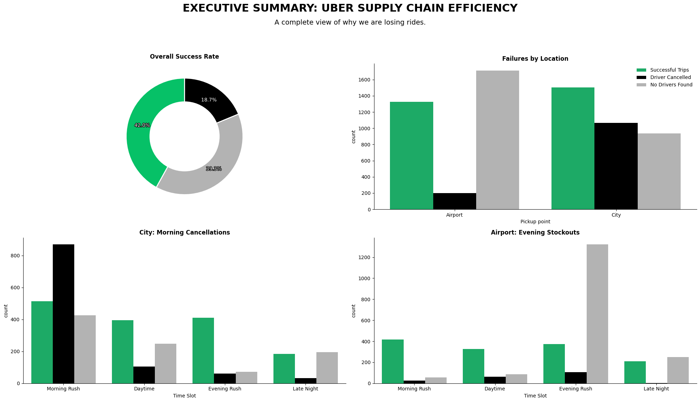

# 🚕 Uber Supply Chain: Solving the 58% Fulfillment Gap

)

## 📖 Project Overview
Analyzing Uber's service reliability between City and Airport hubs to identify supply-demand mismatches and revenue leakage.

## ⚠️ Problem Statement
Uber is facing a **58% service failure rate**. This analysis diagnoses whether these failures are caused by driver behavior (cancellations) or physical inventory shortages (no cars available).

## 📊 Datasets Summary
* **Volume:** 6,745 ride requests.
* **Nodes:** City and Airport pickup points.
* **Attributes:** Timestamps, Trip Status, and Driver IDs.

!

## 🛠️ Tools Used
* **Language:** Python 3.x
* **Libraries:** Pandas (Cleaning), Seaborn & Matplotlib (Visuals).
* **Environment:** Google Colab & GitHub.

## 🧪 Methodology & Analytical Approach
* **Data Normalization:** Standardized inconsistent date delimiters (`/` and `-`) to ensure chronological integrity.
* **Feature Engineering:** Engineered raw timestamps into **5 Strategic Time-Bins** to isolate peak-hour failure modes.
* **Logistics Logic:** Classified `NaN` values as **Inventory Stockouts** rather than missing data to measure true supply-demand gaps.
* **Multivariate EDA:** Correlated trip status with geographic nodes to identify mirrored bottlenecks.

## 📉 Summary of Analysis & Visualizations
> **Insight:** We found a mirrored bottleneck. City failures are driven by cancellations in the morning; Airport failures are driven by car shortages in the evening.

## 🚀 Strategic Recommendations (High-Impact)
* **Dynamic Incentive Calibration:** Implement a **"Long-Trip Premium"** for City drivers (5 AM - 9 AM) to offset "deadhead" return costs and eliminate morning cancellations.
* **Pre-emptive Inventory Staging:** Deploy a **Predictive Positioning** strategy to move idle vehicles to the Airport 45 minutes prior to peak evening flight arrivals.
* **Surge Pricing Recalibration:** Apply automated surge multipliers specifically to Airport-bound trips during morning peaks to align driver supply with high-effort routes.
* **Driver Loyalty Rewards:** Offer "Consistency Bonuses" for drivers who maintain a <10% cancellation rate during the critical morning window in the City node.

## 🏁 Conclusion
This analysis demonstrates that Uber's 58% fulfillment gap is not a result of a general driver shortage, but a **geographic and temporal misalignment** of supply. By addressing the behavioral barriers in the City (Morning) and the inventory shortages at the Airport (Evening), Uber can significantly increase its service level without necessarily increasing its total fleet size. Transitioning from reactive dispatching to **predictive rebalancing** is the key to capturing lost revenue and improving long-term customer retention.

## 📂 Project Assets & Data Access
* **Interactive Notebook:** [Direct Link to Google Colab]([PASTE_YOUR_COLAB_URL_HERE](https://colab.research.google.com/github/lilaaash/Uber_Supply_Chain_Analysis/blob/main/Uber_Supply_Chain_Analysis.ipynb))
* **Raw Dataset:** [View Uber_Request_Data.csv](./Uber_Request_Data.csv)
* **Cleaned Dataset:** [View Uber_Request_Data.csv](./Uber_Request_Data.csv)

## 📚 Data Source & Citation
* **Author:** Manish Kumar (UpGrad/IIIT-B).
* **Source:** [Kaggle - Uber Request Data](https://www.kaggle.com/datasets/hellbuoy/uber-supplydemand-gap).
