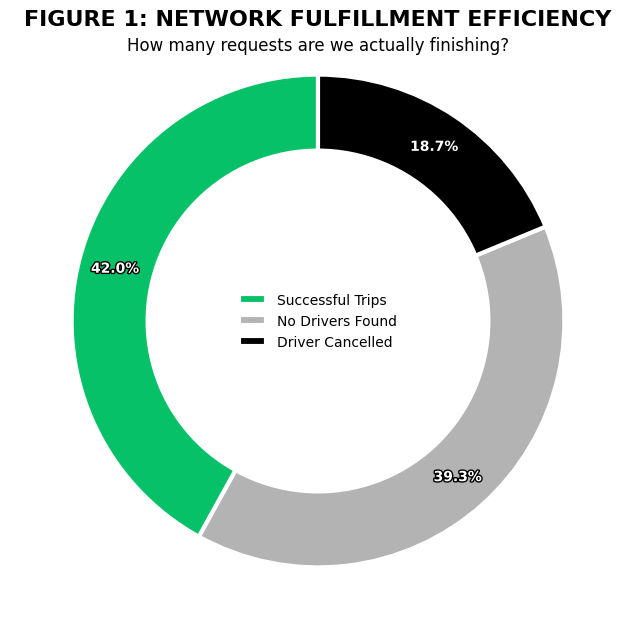
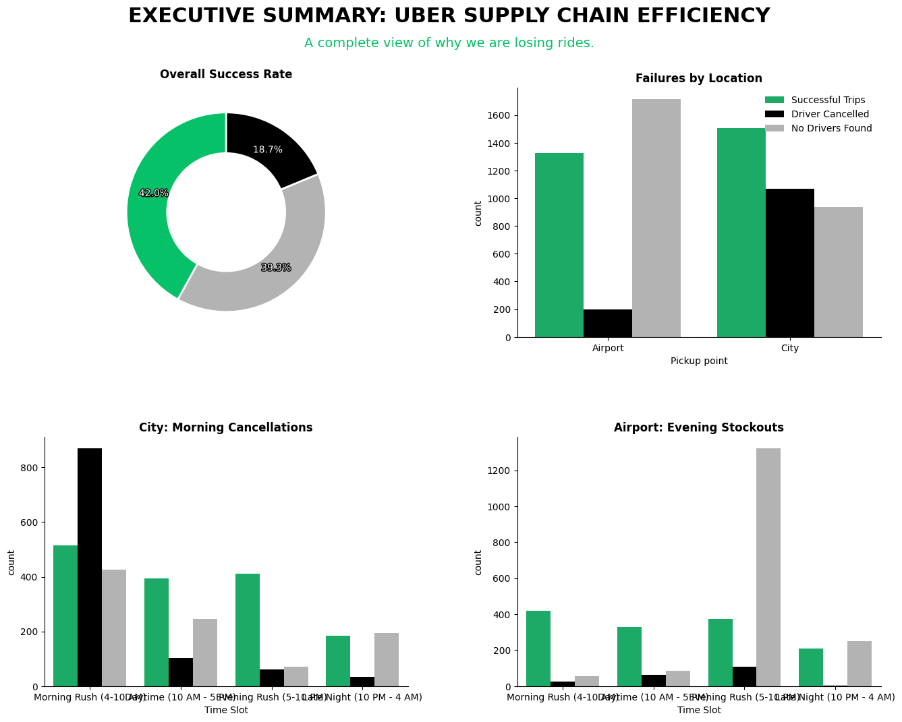

# 🚕 Uber Supply Chain: Solving the 58% Fulfillment Gap

)

## 📖 Project Overview
Analyzing Uber's service reliability between City and Airport hubs to identify supply-demand mismatches and revenue leakage.

## ⚠️ Problem Statement
Uber is facing a **58% service failure rate**. This analysis diagnoses whether these failures are caused by driver behavior (cancellations) or physical inventory shortages (no cars available).

## 📊 Datasets Summary
* **Volume:** 6,745 ride requests.
* **Nodes:** City and Airport pickup points.
* **Attributes:** Timestamps, Trip Status, and Driver IDs.

## 🛠️ Tools Used
* **Language:** Python 3.x
* **Libraries:** Pandas (Cleaning), Seaborn & Matplotlib (Visuals).
* **Environment:** Google Colab & GitHub.

## 🧪 Analytical Approach
1. **Wrangling:** Standardized mixed date formats into uniform datetime objects.
2. **Feature Engineering:** Segmented data into "Morning," "Evening," and "Late Night" bins to track peak-hour behavior.
3. **Visualization:** Used categorical plots to isolate failure types by location and time.

## 📉 Summary of Analysis & Visualizations
> **Insight:** We found a mirrored bottleneck. City failures are driven by cancellations in the morning; Airport failures are driven by car shortages in the evening.

## 🚀 Strategic Recommendations
* **Morning (City):** Incentivize airport-bound trips to prevent cancellations.
* **Evening (Airport):** Pre-position "idle" city drivers to the airport 30 minutes before peak flight landings.

## 📦 Deliverables
1. **Interactive Notebook:** [View on Google Colab](PASTE_YOUR_COLAB_URL_HERE)
2. **Cleaned Data:** Available in the repository root.

## 📚 Data Source & Citation
* **Author:** Manish Kumar (UpGrad/IIIT-B).
* **Source:** [Kaggle - Uber Request Data](https://www.kaggle.com/datasets/hellbuoy/uber-supplydemand-gap).
